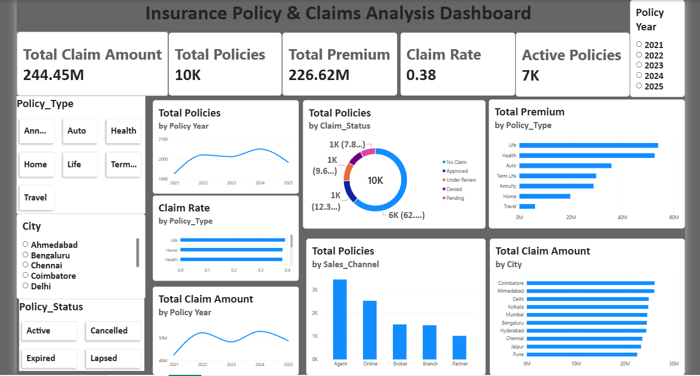

# 🛡️ Insurance Policy & Claims Analysis Dashboard

A Power BI dashboard built to analyze insurance policies, premiums, claims, customer locations, and sales channels.

## Overview

This project uses 10,000 insurance policy records to understand policy performance and claim trends.

The dashboard provides insights into:

- Total policies and active policies
- Total premium and claim amount
- Claim rate and claim status
- Premium by policy type
- Policies by sales channel
- Claim amount by city

## Dashboard KPIs

- Total Policies: 10K
- Total Premium: 226.62M
- Total Claim Amount: 244.45M
- Active Policies: 7K
- Claim Rate: 38%

## Dataset Columns

- Customer ID
- Policy ID
- Customer Name
- Age
- City
- Policy Type
- Policy Start Date
- Policy Status
- Annual Premium
- Sum Assured
- Claim Status
- Claim Amount
- Deductible
- Sales Channel
- Payment Mode

## 🛠️ Tools Used

- Power BI Desktop
- Power Query
- DAX
- CSV Dataset
- Python(jupyter notebook)

## 📌 Key Insights

- Life policies generate the highest premium.
- Agent sales channel has the highest number of policies.
- Most policies have no claims.
- Claim amount varies across cities and policy types.
- The dashboard supports filtering by policy year, city, policy type, and policy status.

## 👩‍💻 Author

**Navitha**  
Power BI Dashboard Developer
